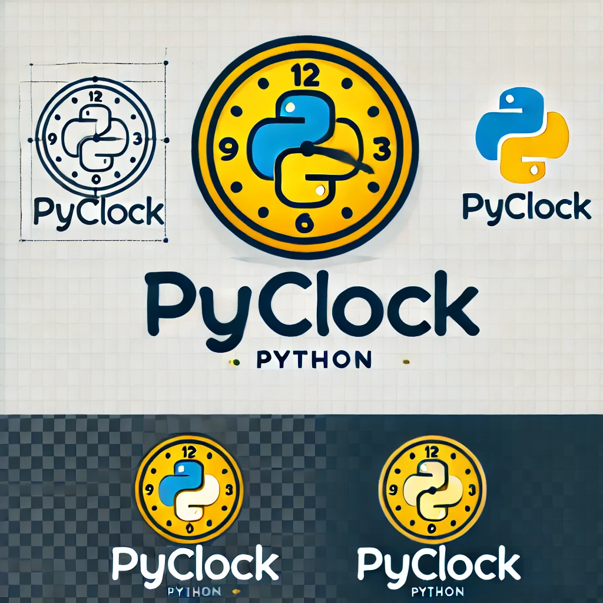
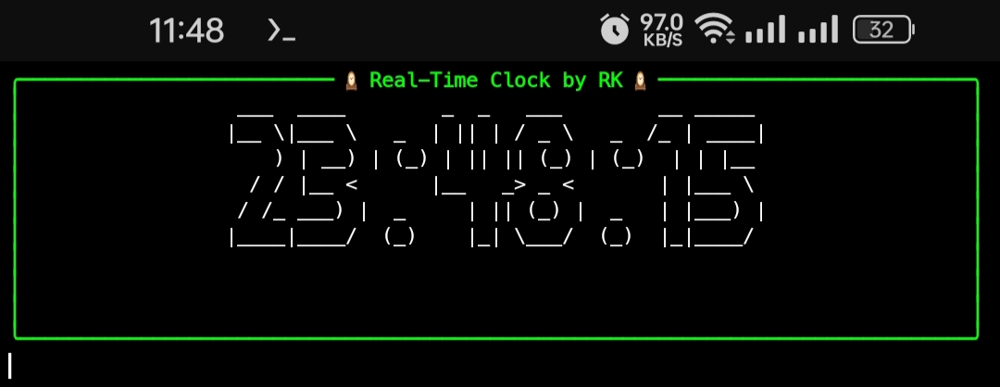
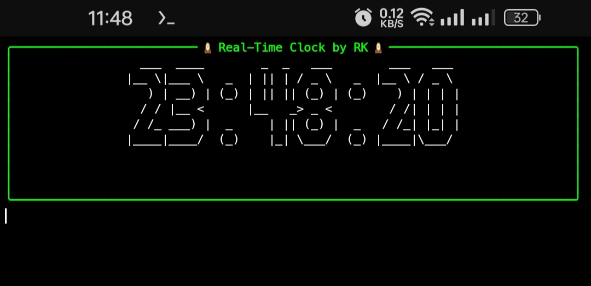

# pyClock 🕰️

---


---
`pyClock` is a real-time, terminal-based clock created using Python, `rich` library for a colorful user interface, and `pyfiglet` for beautiful ASCII clock styling. The clock continuously updates every second, offering a visually appealing and interactive experience in your terminal.

## Features 🌟

- **Real-time Clock**: The clock updates every second, showing the current time in `HH:MM:SS` format.
- **ASCII Art**: The current time is displayed in a stylish ASCII format, using the `pyfiglet` library.
- **Colorful Interface**: The time display is wrapped in a beautifully styled `rich` panel with customizable border and title.
- **Terminal-based**: Perfect for enhancing your terminal experience with a professional touch.

## Requirements 📦

Before running the project, you need to install the required dependencies:

- Python 3.x
- `rich` library
- `pyfiglet` library

To install the dependencies, run the following command:

```bash
pip install rich pyfiglet
```

## Usage 🚀

1. Clone the repository:

```bash
git clone https://github.com/rkstudio585/pyClock.git
cd pyClock
```

2. Run the program:

```bash
python clock.py
```

The clock will start displaying in your terminal and update every second.

## Code Explanation 🧑‍💻

### `clock.py`

This Python script runs the real-time clock in the terminal.

- **Imports**: 
  - `time`: For fetching the current system time.
  - `pyfiglet`: For creating the ASCII art representation of the current time.
  - `rich.console.Console`: For printing styled content in the terminal.
  - `rich.panel.Panel`: For adding a panel around the clock with customized borders and title.

- **Display Loop**: 
  - The script runs in a continuous loop, updating the clock every second.
  - The `time.strftime("%H:%M:%S")` function fetches the current time.
  - `pyfiglet.figlet_format` generates the ASCII art for the time.
  - The clock is then displayed in a `rich` panel with a title and border.

- **Interrupt Handling**: The clock can be stopped using a keyboard interrupt (`Ctrl+C`), and a message will be displayed to confirm the stop.

### Code Snippet

```python
import time
import pyfiglet
from rich.console import Console
from rich.panel import Panel
from rich.text import Text

console = Console()

def display_clock():
    try:
        while True:
            current_time = time.strftime("%H:%M:%S")
            ascii_time = pyfiglet.figlet_format(current_time, font="big")
            clock_panel = Panel(Text(ascii_time, justify="center"), title="🕰 Real-Time Clock 🕰", border_style="bold green")
            
            console.clear()
            console.print(clock_panel)
            time.sleep(1)

    except KeyboardInterrupt:
        console.print("Clock stopped.", style="bold red")
```

### Key Components:
- **Real-time update**: The clock updates every second using `time.sleep(1)`.
- **ASCII Style**: `pyfiglet` turns the time into an ASCII art style.
- **Rich Panel**: The time is displayed within a styled panel using `rich`.

## Contributing 🤝

Feel free to fork the repository, clone it, and make improvements. If you add any new features or fix bugs, please create a pull request.

## Screenshots 🖼️ 

> This Screenshot Take In Termux.
 > 
 > 
 > 

## License 📜

This project is licensed under the MIT License - see the [LICENSE](LICENSE) file for details.

---

Happy Clocking! ⏰
